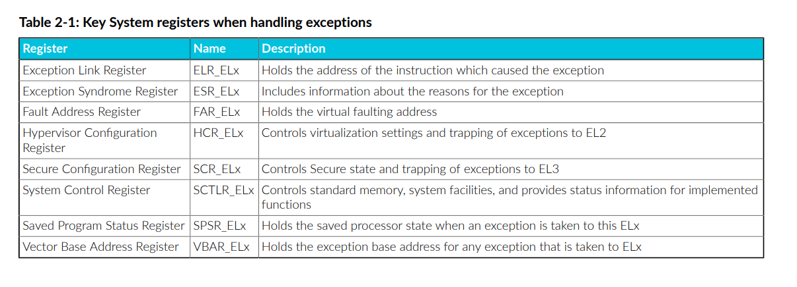

# 学习体系结构 - AArch64 异常模型

> Learn the architecture - AArch64 Exception Model
>
> version 1.3

## 1、Overview

AArch64异常模型指南，介绍了Armv8-A和Armv9-A中的异常和特权模型。它涵盖了Arm架构中**不同类型的异常**以及**处理器在处理异常时的行为**。

该内容面向底层代码的开发人员，比如引导代码或内核开发者。**特别适用于编写设置或管理异常的代码的人员。**

在指南的结尾，你可以检查你的知识。你将能够列出**异常级别**，说明它们之间的执行转移方式，并命名并描述执行状态。你还将能够详细描述简单**AArch64向量表**的组成部分，以及描述**异常处理程序**的使用方式。

## 2、Privilege and Exception levels

在我们解释AArch64异常模型的细节之前，我们需要介绍 **特权** 的概念。

现代软件被设计为分为不同的模块，**每个模块对系统和处理器资源具有不同的访问级别**。一个例子是操作系统内核和用户应用程序之间的分离。操作系统需要执行一些动作，我们不希望用户应用程序能够执行。内核需要对系统资源有高级别的访问，而用户应用程序只需要有限的配置系统的能力。**特权决定了软件实体可以看到和控制哪些处理器资源。**

AArch64架构通过实现不同级别的特权来实现这种分离。**当前的特权级别只能在处理器发生异常或从异常返回时才能改变**。因此，**在Arm架构中，这些特权级别被称为异常级别**。

### 2.1、 Exception levels

在AArch64中，特权的名称是**异常级别**，通常简称为**EL**。异常级别被编号，通常缩写为EL\<x\>，其中\<x\>是介于0和3之间的数字。**特权级别越高，数字越大。例如，最低特权级别被称为EL0。**

如图2-1所示：异常级别，**有四个异常级别：EL0、EL1、EL2和EL3。**

架构并未规定软件使用哪个异常级别。**常见的使用模型是应用程序代码在EL0运行，而像Linux这样的强大操作系统运行在EL1上。EL2可能被虚拟化管理程序（hypervisor)使用，而EL3则被固件和安全网关代码使用。**举例来说，Linux可以通过软件接口标准调用EL3上的固件函数，用于抽象出开启或关闭核心的意图，从而将意图与底层细节分离。**这个模型意味着大部分处理器执行通常发生在EL0/1级别。**

>架构并不强制执行这种软件模式，但标准软件会假定这种模式。因此，本指南的其余部分也假设了这种使用模式。

异常级别只有在发生以下情况时才能改变： 

- **发生异常**
- **从异常中返回**
- 处理器复位
- 调试状态期间
- 退出调试状态

**发生异常时，异常级别可以提高，也可以保持不变。**您永远无法通过发生异常转移到较低的权限级别。**从异常返回时，异常级别可以降低或保持不变。**从异常中返回时，权限级别不会升高。我们将在本指南后面的章节中进一步讨论这个问题。

### 2.2、Types of privilege

与 AArch64 异常模型相关的特权有两种：

- 内存系统中的权限
- 从访问处理器资源的角度看权限

这两种特权都受当前特权例外级别的影响。

#### 2.2.1、Memory privilege

Arm 架构的 A型 实现了虚拟内存系统，其中的内存管理单元 （MMU） 允许软件为内存区域（regions of memory）分配属性（attributes）。这些属性包括 读/写 权限，可配置为允许特权访问和非特权访问的不同访问权限。

当处理器在 **EL0 执行时**启动的内存访问会根据**非特权访问权限**进行检查。从 **EL1、EL2 和 EL3** 进行的内存访问则根据**特权访问权限**进行检查。

由于该内存配置是由软件使用 MMU 的转换表进行编程的，因此应考虑对这些表进行编程所需的权限。**MMU 配置存储在系统寄存器中，访问这些寄存器的能力也受当前例外级别的控制。**

>在 Arm 架构中，寄存器分为两大类：
>
>- 提供 系统控制或状态报告 的寄存器
>- 用于 指令处理 的寄存器，例如用于累积结果和处理异常的寄存器

#### 2.2.2、Register access

AArch64 处理器的配置设置保存在一系列称为系统寄存器的寄存器中。系统寄存器中的设置组合定义了当前的处理器上下文。**对系统寄存器的访问受当前异常级别控制。**

例如，**VBAR_EL1 是矢量基地址寄存器**。本指南稍后将介绍它的用途。现在，重要的是后缀 _EL1。这告诉我们，**软件至少需要有 EL1 权限才能访问该寄存器**。

**该架构有许多寄存器，其功能在概念上相似，但名称仅有异常级别后缀的不同。这些寄存器是独立的单个寄存器，在指令集中有各自的编码，并将在硬件中单独实现。**

> 也就是 仅异常级别后缀不同 的寄存器，它们是真实存在的，独立的寄存器。

每个异常级别都有一个**系统控制寄存器（SCTLR）**。每个寄存器控制该 EL 的架构功能，**如 MMU、高速缓存和校准检查**：

- SCTLR_EL1      EL0 和 EL1 的顶层系统控制
- SCTLR_EL2      EL2 的顶层系统控制
- SCTLR_EL3      EL3 的顶层系统控制

**EL1 和 EL0 共享相同的 MMU 配置，控制权仅限于在 EL1 上运行的特权代码。**因此不存在 SCTLR_EL0，所有控制均由 EL1 访问寄存器进行。其他控制寄存器通常也采用这种模式。

**较高的异常级别有权访问控制较低级别的寄存器。**例如，EL2 有权在必要时访问 SCTLR_EL1。EL0 不能访问该寄存器，任何访问尝试都会产生异常。

在系统的一般运行中，特权异常级别控制自己的配置。不过，**权限较高的级别有时会访问与较低异常级别相关的寄存器。例如，这可能是为了实现虚拟化功能和上下文切换。**

本指南将结合 AArch64 异常模型讨论下列系统寄存器：

> ELR_ELx：保存导致**异常的指令地址**
>
> ESR_ELx：包括**异常原因**的信息
>
> FAR_ELx：保存虚拟故障地址
>
> HCR_ELx：控制**虚拟化设置** 和 向 EL2 捕捉异常
>
> SCR_ELx：控制**安全状态** 和 向 EL3 捕捉异常
>
> SCTLR_ELx：控制**标准内存和系统设施**，并为已执行的功能提供**状态信息**
>
> SPSR_ELx：当该 ELx 出现异常时，保持已**保存的处理器状态**
>
> VBAR_ELx：为任何被带入 ELx 的异常保存**异常基地址**

## 3、Execution and Security states

AArch64 架构提供**四个异常级别**。此外，还有**两种执行状态**和多达**四种安全状态**。Armv8-A 或 Armv9-A 处理器的当前状态由异常级别和当前执行状态决定。

### 3.1、Execution states

当前的执行状态定义了**通用寄存器的标准宽度**和**可用指令集**。执行状态还影响内存模型和异常管理方式。

Armv8-A 和 Armv9-A 支持两种执行状态：

- **AArch32** 是 32 位执行状态。该状态下的操作向后兼容以前的架构。它支持 T32 和 A32 指令集。标准寄存器宽度为 32 位。
- **AArch64** 是 64 位执行状态。它支持 A64 指令集。标准寄存器宽度为 64 位。

本指南后面几章将更深入地介绍 AArch64 如何处理异常。

#### 3.1.1、Changing Execution state

**处理元件 (PE) 只能在 重置 或 异常级别发生变化时 改变执行状态**。当 PE 在异常级别之间移动时，可以改变执行状态，但在 AArch32 和 AArch64 之间的转换只能根据附加规则进行：

- 从较低的异常级别转到较高的异常级别时，执行状态可以保持不变，也可以变为 AArch64。
- 从较高异常级别转到较低异常级别时，执行状态可以保持不变，也可以变为 AArch32。

将这两条规则放在一起，就意味着 64 位层可以托管 32 位层，但反之则不行。例如，64 位操作系统内核可以托管 64 位和 32 位应用程序，而 32 位操作系统内核只能托管 32 位应用程序。

下图说明了这些情况：

在这个例子中，我们使用了操作系统和应用程序，但同样的规则适用于所有例外级别。例如，EL2 级的 32 位管理程序只能托管 EL1 级的 32 位操作系统。

**Armv8-A 体系结构支持所有异常级别的 AArch32 和 AArch64 执行状态。**每个异常级别可选择支持其中一种或两种。

对于 Armv8-A 处理器，复位时的执行状态由实施定义机制决定。例如，Cortex-A32 始终复位到 AArch32 状态。

对于 Armv9-A 处理器，所有 EL 都必须支持 AArch64。至于是否在 EL0 支持 AArch32，则由执行选择。所有其他异常级别均为 AArch64，复位时执行状态始终为 AArch64。

**每个异常级别的执行状态由下一个更高执行异常级别的控制寄存器定义。**这利用了 EL2 的管理程序配置寄存器 (HCR_EL2) 和 EL3 的安全配置寄存器 (SCR_EL3)。复位时，如果可切换，EL3 的执行由外部引脚设置。**路由和中断控制器**部分将进一步介绍这一主题。

### 3.2、Security states

AArch64 允许执行多种安全状态。这样就可以进一步划分软件，将可信软件隔离开来。

大多数 Cortex-A 处理器支持两种安全状态：

- **Secure state**：**在这种状态下，处理单元 (PE) 可以访问安全和非安全物理地址空间，以及 banked 寄存器的安全副本。**
- **Non-secure state**：这通常也被称为 "Normal world"。**在这种状态下，PE 只能访问非安全物理地址空间。PE 只能访问允许非安全访问的系统寄存器。**

> 大多数情况下接触的都是 Non-secure state
>
> 注意 **Security states** 表示的是这一总称，**包括 Secure state 和 Non-secure state**

Security state 定义了可以 访问哪些已实施的异常级别、当前可以访问哪些内存区域 以及 这些访问在系统内存总线上的表示方式。在Non-secure state下，PE 只能访问非安全物理地址空间。 在Secure state下，PE 可以访问安全和非安全物理地址空间。

例如，您的操作系统（如安卓系统）运行在普通世界，而支付或 DRM 系统运行在安全世界。我们需要对安全世界的系统有更高的信任度，因此需要将它们分开，以保护支付详情和密钥等信息。拥有两种安全状态就能实现这种分离。

该图显示了**异常级别**和**安全状态**，以及不同的**执行状态**：

这些安全状态的用途在我们的 AArch64 TrustZone 指南中有更详细的描述。

#### 3.2.1、 Changing Security state

如果实施了 TrustZone，那么处理器可以处于安全状态或非安全状态。 这由 SCR_EL3.NS 位选择。

您可能已经注意到，EL3 处于 "安全 "状态。**EL3 是权限最高的异常级别，EL3 的安全状态是固定的**。EL3 可以访问banked 系统寄存器的所有副本。

**在 Armv8-A 中，EL3 始终处于安全状态。**在 Armv9-A 中，EL3 是安全状态的一部分，除非实施了 RME。如果实施了 RME，根状态就是将 EL3 从安全状态的其他部分分离出来。下一节将详细介绍 RME。

**无论何时要从一种安全状态切换到另一种安全状态，都必须通过 EL3。**EL3 的软件负责管理对不同可用安全状态的访问，并充当守门员，控制对 EL2、EL1 和 EL0 安全状态的访问。**从 EL3 返回时，SCR_EL3.NS 位可改变安全状态。**

在 EL0、EL1 和 EL2，PE 可以处于安全状态或非安全状态。通常会写成

- NS_EL1: Non-secure state, Exception level 1

- S_EL1: Secure state, Exception level 1

更改安全状态在 TrustZone for AArch64 和 Realm Management Extension 中有更详细的讨论。

#### 3.2.2、 Realm Management Extension

主要介绍ARMv8，这部分跳过

### 3.3、Impact of implemented Exception levels

对于任何特定处理器来说，是否执行所有异常级别，以及每个执行的异常级别允许哪些执行状态，都是执行过程中的选择。

EL0 和 EL1 是唯一必须执行的例外级别，也是强制性的。EL2 和 EL3 是可选的。

请注意，如果尚未实施 EL3 或 EL2，则应考虑以下情况：

- **EL2 包含许多虚拟化功能。**没有 EL2 的程序无法使用这些功能。有关虚拟化的更多信息，请参阅 AArch64 virtualization guide。
- **EL3 是唯一能改变安全状态的级别。**如果实施方案选择不实施 EL3，则 PE 只能访问单一的安全状态。因此，您永久处于的状态是实施定义的。

目前已开发出几种软件实现，要求平台支持这些异常级别。例如，KVM Linux 需要 EL2、EL1 和 EL0。

在 Armv8.0-A 中，EL2 仅存在于非安全状态，因为安全状态下不支持虚拟化。Armv8.4-A 增加了 S.EL2，将其作为一项可选功能，并增加了一个启用位（SCR_EL3.EEL2），以实现向后兼容。在 Armv9-A 中，如果支持 EL2，则必须在两种安全状态下都支持它，但禁用位仍然存在。

Armv8-A 处理器的实现可以选择对每个异常级别有效的执行状态，这是由实现定义的。如果某个异常级别允许 AArch32，那么所有更低的异常级别也必须允许。例如，如果 EL3 允许 AArch32，那么所有较低的异常级别都必须允许。

许多实施方案允许所有执行状态和所有异常级别，但也有一些现有实施方案存在限制。例如：

- Cortex-A35 支持所有异常级别的 AArch32 和 AArch64
- Cortex-A32 仅支持 AArch32
- Neoverse-N2 的 EL0 支持 AArch32。所有其他异常级别仅支持 AArch64

AArch32 提供了与旧 32 位架构的向后兼容性，从 Armv9-A 开始，AArch32 只限于在 EL0 级可选实施。Armv9-A 在所有例外级别都支持 AArch64，仅在 EL0 中可选择支持 AArch32。这意味着可以运行传统应用程序，但不能运行内核、管理程序或固件。

您应参阅处理器的《技术参考手册》（TRM），查看支持哪些异常级别。

## 4、Exception types

异常是指通常需要 采取补救措施 或 由特权软件更新系统状态 以 确保系统顺利运行的条件或系统事件。因此，异常是任何可能导致当前执行程序暂停的事件。出现异常会导致状态改变，从而执行代码来处理该异常。

其他处理器架构可能将其描述为中断。**在 AArch64 中，中断是外部生成异常的一种特殊类型。**

使用异常情况有许多不同的原因，包括以下原因：

- 模拟虚拟设备
- 虚拟内存管理
- 处理软件错误
- 处理硬件错误
- 调试
- 执行对不同权限或安全状态的调用
- 处理中断（计时器、设备交互）
- 跨不同执行状态处理（称为进程间处理）

**当出现异常时，处理器不是转到当前代码中的下一条指令，而是停止当前的执行，并分支到一段代码来处理请求。这段代码被称为异常处理程序。**一旦事件得到处理，执行程序就可以返回到原来的程序。每种异常类型都有自己的异常处理程序。如图 4-1：异常处理（第 18 页）所示。

Arm 架构将异常分为两大类：**同步异常和异步异常**。

### 4.1、Synchronous exceptions

**同步异常是由当前正在执行的指令引起或与之相关的异常。**同步异常与执行流同步，因为它们与当前执行的指令直接相关。例如，当指令试图写入 MMU 定义的只读位置时，就会触发同步异常。

如果以下情况都适用，则异常是同步的：

- 异常是由于直接执行或试图执行一条指令而产生的。 

- 异常处理后返回的地址（返回地址）与导致异常的指令之间存在架构上的定义关系。 
- 异常是精确的，这意味着进入异常处理程序时显示的寄存器状态与违规指令之前的每条指令都一致，而与之后的指令都不一致。

**同步异常有许多不同类型，一条给定指令可能会导致多个同步异常。Arm 架构为同步异常提供了固定的优先级顺序。**

下面几节将更深入地讨论同步异常的一些不同原因：

- 无效指令和陷阱异常 
- 内存访问
- 异常产生指令
- 调试异常

#### 4.1.1、Invalid instructions and trap exceptions

**试图执行无效指令可能会导致同步异常。**导致无效指令的原因有很多，包括未定义指令、当前异常级别不允许执行的指令或已禁用的指令。任何试图执行内核无法识别的指令的尝试都会产生 UNDEFINED 异常。

**该架构还允许操作系统或虚拟机管理程序等控制实体设置陷阱，以拦截较低异常级别的操作。**当执行特定操作（如读取特定寄存器）时，陷阱会触发异常。

例如，EL1 的操作系统内核可能会在 EL0 禁用浮点指令，以节省在应用程序之间进行上下文切换的时间。这就是所谓的 "**懒惰上下文切换**"；如果在上下文切换之前没有使用 SIMD 或浮点（FP）单元，则可以减少推送到堆栈的寄存器数量。然后可以使用陷阱异常来处理边缘情况。

在这种情况下，**操作系统内核可以通过禁用 SIMD/ FP 单元来监控 SIMD/FP 操作的状态**。当执行 FP 或 SIMD 指令时，在 EL1 处会向操作系统内核发送陷阱异常。然后，内核可以启用 SIMD/FP 单元，执行失败的指令，并设置一个标志，说明 SIMD/FP 单元已被使用。这可确保在下一次上下文切换时，寄存器上下文中包含大型 SIMD/FP 寄存器文件。如果下一次上下文切换时没有标志，则不需要将 SIMD/FP 寄存器包括在内。

**捕获异常的功能对虚拟化尤为重要。**有关虚拟化如何使用异常的更多信息，请参阅  AArch64 virtualization guide。

#### 4.1.2、Memory accesses

**内存访问也可能导致同步异常。**这可能是 MMU 执行检查的结果，也可能是内存系统返回的错误。

例如，当启用 MMU 时，所有由加载和存储指令引起的内存访问都会受到检查。**如果试图从非特权代码访问特权地址，或试图写入只读地址，则 MMU 会阻止访问并触发内存管理单元（MMU）故障。**由于 MMU 产生的错误是同步的，因此异常会在继续访问内存之前发生。

内存访问错误将在  AArch64 memory management guide 中详细讨论。内存访问还可能产生异步异常，本指南稍后的 SError 部分将对此进行介绍。

在 AArch64 中，同步中止会导致同步异常。异步中止会导致 SError 中断异常。

#### 4.1.3、Exception-generating instructions

**有些指令会故意导致异常的产生和发生。**这些指令用于实现系统调用接口，允许权限较低的软件请求权限较高的软件提供服务。**这些指令有时被称为系统调用，通常用于基于软件的应用程序接口。**

Arm 架构包含**异常生成指令 SVC、HVC 和 SMC**。这些指令的唯一目的是产生异常，使 PE 能够在异常级别之间移动：

- 监督员调用 (SVC) 指令可让 EL0 的用户程序请求 EL1 的操作系统服务
- 虚拟管理程序调用 (HVC) 指令（如果实施了虚拟化扩展）可让操作系统请求 EL2 虚拟管理程序服务
- 安全监控调用 (SMC) 指令（如果实施了安全扩展，则可用）使正常世界能够 请求EL3 固件 的安全世界服务

当 PE 在 EL0 级执行时，它不能直接调用 EL2 级的管理程序或 EL3 级的安全监控程序，因为调用只能在 EL1 及更高级别执行。**EL0 的应用程序必须使用 SVC 调用内核，并由内核执行调用更高异常级别的操作。**

假设已执行了相应的异常级别，**操作系统内核（EL1）可执行 HVC 指令调用 EL2 的管理程序，或使用 SMC 指令调用 EL3 的安全监控程序。**下图对此进行了说明：

由于不能对较低的 EL 进行异常处理，因此在 EL2 发出的 SVC 调用不会返回 EL1。

如前文有关 **无效指令和陷阱异常** 的讨论所述，管理程序可能会向 EL1 展示系统的仿真视图。在这种情况下，客户操作系统将无法使用 SVC 直接调用设备固件。相反，**通过设置管理程序配置寄存器（Hypervisor Configuration Register）中的 HCR_EL2.TSC 位，此类调用将被捕获到 EL2。**

> HCR_EL2.TSC 即 Trap SMC，**当 `TSC` 位为 1 时，在 EL2 下发生 SMC 指令时会生成一个陷阱到 EL2**。这个陷阱允许虚拟化监控软件（hypervisor）处理 SMC 指令，可以在 SMC 调用之前或之后拦截、修改或补充处理这些调用。

#### 4.1.4、Debug exceptions

**调试异常是同步异常，会被路由到调试器托管的异常级别。**调试器代码的执行方式与异常处理程序代码类似。

有许多特定的调试异常是同步的，包括：

- 断点指令异常
- 断点异常
- 监视点异常
- 向量捕捉异常
- 软件步骤异常

有关调试异常及其处理方法的更多信息，请参阅 AArch64 self-hosted debug guide。

### 4.2、Asynchronous exceptions

某些类型的异常由外部产生，因此与当前指令流不同步。

**异步异常与当前执行的指令没有直接关联，通常是来自处理器外部的系统事件。**这可能是软件需要响应的系统事件，如计时器的活动或屏幕的触摸。我们不知道它们何时会发生。

根据定义，异常如果不是同步的那就是异步的。**异步异常也称为中断。**

### 4.2.1、 Physical interrupts

**物理中断是针对来自 PE 外部（通常是外设）的信号而产生的中断。**与内核不断轮询外部信号不同的是，系统通过产生中断通知内核有事情要发生。

例如，一个系统可能使用通用异步接收器/发送器（UART）接口与外界通信。当 UART 接收到数据时，它需要一种机制来告诉处理器新数据已经到达并准备好进行处理。UART 可以使用的一种机制是产生中断，向处理器发出信号。

**复杂的系统可能有许多具有不同优先级的中断源，包括嵌套中断处理能力，其中优先级较高的中断可以中断优先级较低的中断。**内核响应此类事件的速度可能是系统设计中的一个关键问题，称为中断延迟。

接下来，我们将了解不同类型的物理中断。

### 4.2.2、SError

系统错误 (SError) 是一种异常类型，由内存系统针对意外事件生成。我们并不期望发生这些事件，但需要知道它们是否已经发生。这些异常是异步报告的，因为触发事件的指令可能已经退役。

SError 中断的一个典型例子就是以前所说的外部异步中止。 SError 中断的例子包括：

- 已通过所有 MMU 检查的内存访问，但在内存总线上遇到错误
- 某些 RAM（例如内置高速缓存中的 RAM）的奇偶校验或纠错码 (ECC) 检查
- 从高速缓存行向外部内存回写脏数据引发的中止

**SErrors 被视为单独的异步异常类别，因为您通常会为这些情况设置单独的处理程序。**SError 的生成是由实施定义的。

### 4.2.3、IRQ and FIQ

**Arm 架构有两种异步异常类型，即 IRQ 和 FIQ，旨在用于支持外设中断的处理。**它们用于发出外部事件信号，如定时器熄灭，并不代表系统错误。它们是与处理器指令流异步的预期事件。

在旧版本的 Arm 架构中，FIQ 被用作优先级较高的快速中断。**这与 AArch64 不同，在 AArch64 中，FIQ 的优先级与 IRQ 相同。**

几乎在所有情况下，中断控制器都与 AArch64 处理器配对使用，以便整理、优先级排序并处理所有中断。**所有 Arm 实现都使用 Arm 通用中断控制器 (GIC) 架构来管理 IRQ 和 FIQ。**GIC 执行中断管理、优先级排序和路由选择等任务，为核心提供每种物理中断类型的单一信号。有关 GIC 架构的更多信息，请参阅  Arm Generic Interrupt Controller v3 and v4 guide。

### 4.2.4、 Virtual interrupts

使用虚拟化的系统对中断处理的需求更为复杂。有些中断可能由管理程序处理，有些可能在虚拟机内处理。**虚拟机看到的中断是虚拟中断。虚拟中断可以由连接到中断控制器的设备从外部生成，也可以由软件生成。**因此，AArch64 需要额外的机制来支持虚拟中断。

- vSError, Virtual System Error
- vIRQ, Virtual IRQ
- vFIQ, Virtual FIQ

虚拟中断按中断类型进行控制。**这些虚拟中断的功能与物理中断相同，但只能向 EL1 发出信号。**

虚拟中断可在 EL2 处从管理程序或通过中断控制器发生。**管理程序必须设置管理程序配置寄存器 (HCR_EL2) 中的相应路由位。**例如，要启用 vIRQ 信号，管理程序必须设置 HCR_EL2.IMO。该设置可将物理 IRQ 异常路由至 EL2，并启用将虚拟异常信号向 EL1。

HCR_EL2 中有三个控制虚拟中断产生的位：

- VSE 设置该位将注册一个 vSError
- VI 设置该位将注册一个 vIRQ
- VF 设置该位将注册一个 vFIQ

设置其中一个位相当于中断控制器向 vCPU 发出中断信号。这种方法的影响是，管理程序需要在虚拟机中模拟中断控制器的运行。**这在频繁操作时可能会造成很大的开销，因此建议使用中断控制器。**

**GICv2 及更高版本通过提供物理 CPU 接口和虚拟 CPU 接口，支持物理和虚拟中断信号。**有关中断控制器的更多信息，请参阅 Arm Generic Interrupt Controller v3 and v4。 Armv8.4-A 增加了对安全状态下虚拟化的支持，并要求启用和支持安全 EL2。

虚拟中断将在 AArch64 virtualization guide 中进一步讨论。

### 4.2.5、Masking

**物理和虚拟异步异常都可以临时屏蔽。**这意味着异步异常可以保持待处理状态，直到它们被解除屏蔽和异常被捕获。这对于处理嵌套异常特别有用。

**同步异常不能屏蔽。**这是因为同步异常是由指令的执行直接引起的，因此如果将其搁置或忽略，就会阻塞指令的执行。

2021 扩展（Armv8.8-A 和 Armv9.3-A）增加了对非屏蔽中断（NMI）的支持。当支持并启用该功能时，可通过该功能向处理器显示具有超级优先权的中断。当没有超级优先权的中断被屏蔽时，超级优先权允许中断被触发。

本指南后面的 "路由和中断控制器 " 将进一步介绍屏蔽。异常屏蔽和不可屏蔽中断 (NMI) 部分将更深入地讨论屏蔽和 NMI 功能。

## 5、Handling exceptions

正如我们在 "异常类型 "一章中所介绍的，当异常发生时，当前程序流程将被中断。本章将更深入地讨论如何在实践中处理异常。

在 AArch64 中，在谈论异常时使用了特定的术语：

- 当 PE 响应异常时，异常发生
- 出现异常前的 PE 状态是异常 taken from 的状态
- 出现异常后的 PE 状态是异常 taken to 的状态

因此，当异常被识别时处理器所处的状态被称为异常 taken from 的状态。PE 在异常后立即处于的状态是异常 taken to 的状态。例如，可能发生异常 从 AArch32 EL0 到 AArch64 EL1。

处理异常后，系统需要从所处的状态返回。这就是所谓的 "异常返回"，Arm 架构有触发 "异常返回 "的指令：

- 执行返回指令时 PE 所处的状态就是异常 return from 的状态。
- 异常返回指令执行后立即进入的 PE 状态就是异常 return to 的状态。

### 5.1、Taking an exception

发生异常时，处理器会将 PE 的当前状态与异常返回地址一起保存，然后进入特定模式处理异常。

**当前状态的快照来自 PSTATE**，将在 "保存处理器当前状态 "一节中进一步讨论。**该快照被写入保存程序状态寄存器（SPSR），返回地址被写入异常链接寄存器（ELR）。对于同步异常和 SErrors，还会更新另一个寄存器--异常综合寄存器（ESR）。**这将记录异常的原因。

当使用 AArch64 状态的异常级别 (ELx) 出现异常时，会发生以下所有情况：

- 异常发生前 PSTATE 的内容被写入 SPSR_ELx
- 首选异常返回地址被写入 ELR_ELx

> 也就是说 上面两个情况对于所有异常适用，以下两条对于特定异常有用

此外：

- **对于同步异常和 SError 中断，异常综合征信息（异常原因）将写入 ESR_ELx**
- **对于与地址相关的同步异常，如 MMU 故障，触发异常的虚拟地址将被写入故障地址寄存器 FAR_ELx**

**任何给定异常的处理都是从一个称为异常向量的固定内存地址开始的。**当异常发生时，处理元件（PE）会分支到向量表中的某个位置。

AArch64 中的矢量表与许多其他处理器架构不同，它包含的是指令而不是地址。每个条目最多包含 32 条指令，足以执行基本的堆叠和调用特定的异常处理代码。

**矢量表位置通常配置为包含处理程序代码，以执行通用操作，并根据异常类型分支到进一步的异常处理代码，**如图 5-1: 顶层处理程序（第 28 页）所示。该矢量代码限制为 32 个字。异常处理程序包含处理请求操作的代码，并能从异常状态返回。

每种异常类型都有一个异常级别 (EL)。因此，出现异常时，可以路由到不同的 EL。**这一点尤为重要，因为获得权限的唯一途径就是发生异常。失去或减少权限的唯一方法是执行异常返回。**

这意味着：

- 发生异常时，EL 可以保持不变或增加。
- 异常返回时，EL 可以保持不变或减少。

需要注意的是，处理异常或异常返回不一定要需要改变 EL。**异常的目标 EL 可以与当前 EL 相同。目标 EL 是根据异常类型或系统寄存器中的配置位隐含定义的。**

在 AArch64 中，只能将 EL0 中的异常到更高的异常级别处理，而不会将异常处理到 EL0，也没有 EL0 向量表。

如执行态和安全态一章所述，**PE 也只能在复位或发生异常或从异常返回时改变执行态。**AArch32 和 AArch64 执行状态之间的交互称为进程间交互。请务必牢记以下与更改执行状态有关的内容：

- 从较低的异常级别转到较高的异常级别时，执行状态可以保持不变，也可以变为 AArch64
- 从较高的异常级别转到较低的异常级别时，执行状态可以保持不变，也可以变为 AArch32

以下内容由架构确定：

- 如果某个异常级别使用 AArch32，那么所有较低的异常级别都必须使用 AArch32

- 如果某个异常级别使用 AArch64，那么所有更高的异常级别都必须使用 AArch64

在 Armv9-A 体系结构和某些 v8-A 实现中，AArch32 仅在 EL0 中受支持，EL0 中不能出现异常。这就意味着，要改变 EL0 的执行状态，需要移动到权限更高的 EL，然后再返回。

由于异常可以从 AArch32 传递到 AArch64，因此 AArch64 处理程序代码可能需要访问 AArch32 寄存器。**AArch32 通用寄存器直接映射到 AArch64 寄存器，允许处理程序代码访问 AArch32 寄存器：**

从 AArch32 转到 AArch64 时，AArch32 状态下不可访问的寄存器将保留之前 AArch64 执行状态下的值。对于在两种执行状态下都可访问的寄存器，64 位寄存器的上半部分要么是 0，要么是使用 AArch32 从异常级别获取异常时的旧值：

- 顶部 32 位未知
- 底部 32 位：映射 AArch32 寄存器的值

AArch64 中的寄存器在 AArch64 Instruction Set Architecture guide 中有更深入的讨论。

以下各节将讨论从 异常发生 到 完成异常 的各个步骤。

#### 5.1.1、Saving the current processor state

**AArch64 有一个称为 PSTATE 的处理器状态概念，SPSR 中存储的就是这些信息。**PSTATE 包含当前异常级别和 算术逻辑单元 (ALU) 标志等内容。在 AArch64 中，这些信息包括：

- 条件标志位 Condition flags
- 执行状态控制位 Execution state controls
- 异常屏蔽位 Exception mask bits
- 访问控制位 Access control bits
- 定时控制位 Timing control bits
- 猜测控制位  Speculation control bits

例如，PSTATE 中的以下异常屏蔽位（DAIF）允许屏蔽异常事件。当相关位被设置时，异常不会发生：

- D - 调试异常屏蔽位
- A - SError 异步异常屏蔽位，例如异步外部中止
- I - IRQ 异步异常屏蔽位
- F - FIQ 异步异常屏蔽位

出现异常时，必须保留当前状态，以便日后返回正确状态。**PE 会自动保存异常返回地址和当前 PSTATE**。如 "发生异常时 "所述，**PSTATE 将作为快照保存在 SPSR（保存的程序状态寄存器）中。**

每个异常级别都有一个 SPSR，即 SPSR_ELx。在发生异常时，SPSR_ELx 用于异常发生的异常级别。**例如，如果异常发生在 EL1，则更新 SPSR_EL1。**

**PE 会将当前的 PSTATE 更新为架构中为该异常类型定义的 PSTATE，以反映新的状态。**这包括更新受影响的目标异常级别和安全级别。

在 Armv7 及更早版本中，PSTATE 被称为 CPSR，并以寄存器的形式实现。

**PSTATE 更新后，PE 就可以分支到向量表中的异常处理程序。**执行从 异常类型 定义的 目标异常级别 的异常向量开始。要从异常中返回，处理器可以将 SPSR 的内容恢复到 PSTATE，然后分支到 ELR 中指定的返回地址。如图 5-2 所示：保存和恢复处理器状态（第 31 页）。

#### 5.1.2、Routing and interrupt controllers

**每种异常类型都有一个目标异常级别，**该级别可以是： 

- 根据异常类型隐含
- 由系统寄存器中的配置位定义

异常的目标或由架构固定，或由软件使用路由控制进行配置。不过，**异常永远不会被带到 EL0。**

**同步异常根据与异常生成指令 SVC、HVC 和 SMC 相关的规则进行路由。**在执行时，其他类别的异常可路由到 EL2（Hypervisor）或 EL3（Secure Monitor）。**IRQ、FIQ 和 SErrors 的路由设置是独立的**。例如，可将所有 IRQ 路由到 EL1，如下图所示：

**路由使用安全配置寄存器 SCR_EL3 和管理程序配置寄存器 HCR_EL2 进行配置。**SCR_EL3 寄存器指定将哪些异常路由到 EL3，而 HCR_EL2 寄存器同样指定将哪些异常路由到 EL2。

**这些允许将不同的中断类型路由到不同的异常级别。例如，IRQ 可能由 EL1 级的操作系统处理，而 SErrors 则通常由运行在 EL3 级的固件处理。**

**每个控制寄存器中都有独立的位，可以单独控制 IRQ、FIQ 和 SError 中断。**此外，在路由配置与 HCR_EL2 发生冲突时，使用 SCR_EL3 进行的路由配置会优先于使用 HCR_EL2 进行的路由配置。这些寄存器中的路由位在复位时具有未知值，因此必须通过软件进行初始化。

**通常使用 Arm 通用中断控制器 (GIC) 架构（参见相关指南）来执行中断管理、优先级和路由任务。这可以减少与虚拟化相关的开销。**

**异常不能被调用到未实现的异常级别。**对未实现的异常级别的调用是未定义的。同样，如果在给定的安全状态下，EL2 被禁用或未执行，而试图返回 EL2，则会在异常返回 (ERET) 时产生故障。

前面在 "屏蔽 "一节中提到，异步异常可被暂时屏蔽并处于待处理状态，直到异常被解除屏蔽并被处理。路由也会影响屏蔽，因为屏蔽能力取决于当前和目标异常级别。

**路由到较高异常级别的异常不能被较低 EL 屏蔽。**例如，如果在 EL1 中屏蔽了中断，而中断被路由到 EL2，则 EL1 屏蔽不会影响 EL2 操作。但请注意，当 PE 上一次从 EL2 退出时，可能已经屏蔽 EL2 中断，这仍可能导致中断在进入 EL2 时被屏蔽。

**路由到当前异常级别的异常可以被当前级别屏蔽。而路由到较低异常级别的异常总是被屏蔽。**异常会被挂起，直到处理器切换到与被路由到的异常级别相等或更低级别的异常级别为止。这符合一个规则：在处理异常时，不会因为异常而降低特权级别。

>这个表描述了异常级别变化对异常屏蔽的影响：
>
>- **目标 EL 大于当前 EL（Target EL > Current EL）：** 当目标的异常级别高于当前异常级别时，当前异常级别无法屏蔽该异常。换句话说，**如果一个异常被路由到更高级别的特权级别（例如从 EL1 到 EL2），当前的特权级别（EL1）无法屏蔽该异常，必须去处理它。**
>- **目标 EL 小于当前 EL（Target EL < Current EL）：** 当目标的异常级别低于当前异常级别时，当前异常级别会隐式地屏蔽该异常。**这意味着如果一个异常被路由到比当前特权级别更低的特权级别（例如从 EL2 到 EL1），那么当前特权级别（EL2）会自动屏蔽这个异常，不会立即去处理。**
>- **目标 EL 等于当前 EL（Target EL == Current EL）：** 当目标的异常级别等于当前异常级别时，异常的屏蔽取决于处理器状态寄存器 `PSTATE` 中的屏蔽位设置。**这些屏蔽位允许当前特权级别控制是否屏蔽某些类型的异常。**
>
>**异常的屏蔽状态主要受当前的 `PSTATE` 寄存器中的设置影响。`PSTATE` 寄存器中的屏蔽位决定了在当前特权级别下是否屏蔽某些类型的异常。**

**异常所处异常级别的执行状态由更高的异常级别决定。**假设所有异常级别都已执行，下表显示了如何确定执行状态：

#### 5.1.3、AArch64 vector tables

当使用 AArch64 将异常处理到异常级别时，**向量表是正常内存的一个区域，其中包含用于处理异常的指令。**

当异常发生时，core 需要能够执行与该异常相对应的处理程序。**处理程序就像调度代码一样，识别异常的原因，然后调用相关的处理程序代码来处理异常。内存中存储处理程序的位置称为异常向量。在 AArch64 中，异常向量存储在异常向量表中。**

**每个异常级别都有自己的矢量表，其基址由自己的矢量基址寄存器 VBAR_EL\<x> 定义，其中 \<x> 为 1、2 或 3。请注意，EL0 没有专用的矢量表，因为 EL0 从不接收异常。**

所有矢量表都使用相同的格式。根据异常类型和异常发生的位置，有不同的异常类别条目。**每个异常类别都有一个异常向量，位于向量基地址的固定偏移量处。**

使用的条目取决于以下因素：

- **异常类型**（SError、FIQ、IRQ、Synchronous） 
- 异常**产生和到达的异常级别**
- 需要支持的**执行状态**
- **使用的堆栈指针**（参见堆栈指针选择和堆栈指针寄存器部分）

复位后，VBAR 寄存器的值未定义，因此必须在启用中断前对其进行配置。

下面介绍了向量表中向量基地址的固定偏移量：

权限软件会将这些信息记录到系统寄存器中，这样当异常发生时，内核就能找到相应的处理程序。**向量分为两组，每组又分为两个子组：**

- 来自低级 EL 的异常
  - 使用 AArch32 的低级 EL 
  - 使用 AArch64 的低级 EL
- 来自当前 EL 的异常
  - 选择 SP_ELx 时的异常
  - 选择 SP_EL0 时的异常

因此，异常到达的向量已经提供了异常发生时处理器的状态信息。我们将在 "堆栈指针选择和堆栈指针寄存器 "一节中介绍所选堆栈点的重要性。

请注意，来自较低异常级别报告的执行状态是指被传递到的紧邻下方的异常级别，而不一定是异常发生的那个级别。

例如，**如果从 EL0 到 EL1 出现异常，则根据 EL1 的执行状态选择向量表项。但如果异常从 EL0 进入 EL2，使用的向量则取决于 EL1，而不是 EL0。**这是因为我们通常希望管理程序或其他虚拟化管理软件运行在 EL2，管理运行在 EL0 和 EL1 的虚拟机 (VM)。**管理程序需要了解虚拟机中操作系统的执行状态，而不是操作系统所托管的应用程序。**有一些特殊情况，例如当 HCR_EL2.TGE 设置为 1 时。这个主题在 AArch64 虚拟化指南中有更详细的介绍。

一个简单的异常处理程序会指示系统将所有易损寄存器（根据异常类型可能是所有寄存器）入栈，然后调用特定于异常的处理器代码。在处理完成后，这些寄存器会被恢复，然后调用异常返回指令（ERET）。

**向量表中的32个字空间**足够容纳**入栈指令、调用特定于异常的处理器代码、恢复寄存器以及发起 ERET 返回**的指令。这个流程在第36页的图5-4中有简要的说明：简单异常处理程序示例。

> 32个字的空间为128字节，即0x80，每个向量占据0x80的空间。

#### 5.1.4、Stack pointer selection and stack pointer registers

**在 AArch64 中执行时，架构允许选择两个堆栈指针寄存器：SP_EL0 或 SP_EL\<x>，其中 \<x> 是当前异常级别。**例如，在 EL1 时，可以选择 SP_EL0 或 SP_EL1。在 AArch64 向量表部分提供的向量表示例中可以看到这一点。

发生异常时，会自动选择目标异常级别 SP_ELx 的堆栈指针。PE 选择的堆栈指针是根据以下规则使用 PSTATE 配置的：

- 如果在 EL0 执行，则 PE 使用 EL0 堆栈指针 SP_EL0
- **如果在 EL1、EL2 或 EL3 执行，则 PE 使用由 PSTATE.SP 位确定的堆栈指针**
  - 如果 PSTATE.SP 为 0，则 PE 使用 EL0 堆栈指针 SP_EL0
  - 如果 PSTATE.SP 为 1，则 PE 使用当前异常级别的堆栈指针 ELx

**当我们进入向量表的一级处理程序时，我们使用了 SP_ELx。默认情况下，应使用 SP_ELx 保存寄存器上下文。不过，我们通常会转而使用 SP_EL0 进行进一步处理。**

> 换句话说，在异常处理的初级阶段，处理器使用 `SP_ELx` 来保存当前的异常上下文。但是，在处理过程中，为了进行其他操作或处理其他异常情况，可能需要切换到使用 `SP_EL0` 来执行额外的处理，这样可以避免影响原始的异常上下文。

例如，ELx 堆栈可用于存储可能被异常处理程序影响或破坏的寄存器，以便在从异常返回时恢复这些寄存器。 在处理由堆栈溢出引起的异常时，这对于保持有效的堆栈特别有用。返回操作需要反向执行这一操作。

例如，**如果 PE 在 EL1 处执行，并发出 IRQ 中断信号，则会触发 IRQ 异常。如果已将 IRQ 配置为路由至 EL1，则将使用 SP_EL1，除非 PSTATE.SP 另有配置。**在上面提供的示例向量表中，执行将从地址 VBAR_EL1 + 0x280 开始。

这种分离意味着我们可以将异常进入和高级异常处理所使用的堆栈 与 其他线程使用的堆栈（比如高堆栈使用量的C代码）隔离开来。通常情况下，`SP_EL0` 分配了更大的堆栈空间，因此对于这种情况，它总是更好的堆栈选择。这也意味着异常进入不依赖于主堆栈的状态。在向量表中有专门的条目来支持这种更改，具体可参考第34页的表格5-4：向量表偏移量。

正如在关于 AArch64 向量表的部分提到的那样，异常到达的向量已经提供了关于异常发生时处理器状态的信息。例如，由于异常在异常进入和退出期间应该被屏蔽，所以在向量表区域中的“Exception from the current EL while using SP_ELx”代码只会在异常情况下触发。在这个向量组中的异步异常意味着发生了重要的系统错误，需要进行处理，例如内核恐慌（kernel panic）。

### 5.2、Returning from an exception

异常处理程序处理完异常后，就会返回到异常发生前正在运行的代码中。

它通过以下方式实现这一功能：

1. 恢复所有先前堆叠的可损坏寄存器
2. 启动异常返回指令 (ERET)

ERET 指令从相关的 SPSR 恢复先前的处理器状态，并分支到 ELR 中记录的异常返回地址。异常返回级别是根据 SPSR_EL\<x> 中的值配置的，其中 \<x> 是返回的级别。**SPSR_ELx 还包含目标执行状态。**

SPSR_ELx 中指定的执行状态必须与 SCR_EL3.RW 或 HCR_EL2.RW 中的配置相匹配，否则会产生非法异常返回。

**执行 ERET 指令时，PSTATE 将从 SPSR_ELx 中恢复，程序计数器将更新为 ELR_ELx 中的值。这两项更新以原子方式不可分割地执行，因此 PE 不会处于未定义的状态。**

正如 "保存当前处理器状态 "一节所介绍的，每个 EL 的异常链接寄存器 (ELR) 保存首选异常返回地址。这是由异常类型决定的。

**对于同步服务调用（如 SVC），这是紧随异常调用之后的指令。对于其他同步异常，则是产生异常的指令地址。对于异步异常，首选的异常返回地址是发生异常时尚未完全执行的第一条指令。允许处理程序根据异常类型，在必要时修改 ELR_ELx 的内容。**

### 5.3、Exception handling examples

本节从端到端角度简要介绍同步和异步异常处理的示例。

#### 5.3.1、Synchronous exception handling

正如在关于同步异常的部分所讨论的，**如果异常是由指令直接执行引发的，并且返回地址指示引发异常的指令，那么可以将异常视为同步异常。**以下寄存器提供了处理同步异常以及错误（SErrors）的关键信息：

- 异常情况寄存器（ESR_ELx）提供有关**同步异常的原因和类型的信息**。
- 故障地址寄存器（FAR_ELx）保存**与地址相关的同步异常（如MMU故障）的错误虚拟地址**。
- 异常链接寄存器（ELR_ELx）保存引发异常的指令地址，提供异常的返回地址。

以下是使用系统调用的AArch64异常模型的简单示例。**如果在较低的异常级别下运行的代码需要执行特权操作，则需要向更高的异常级别发出调用。**例如，在EL0下运行的AArch32应用代码可能需要请求来自EL1的AArch64操作系统/内核的堆内存分配。为了实现这一点，它通过执行SVC指令生成了一个监管系统调用，触发了以下操作：

- 当前的PSTATE被保存为SPSR_EL1中的快照
- **首选的异常返回地址（下一条指令）被写入ELR_EL1**
- 异常情况信息（异常的原因）被写入ESR_EL1
- 通过读取Hypervisor Configuration Register HCR_EL2.RW的RW位来确定目标执行状态
- 当前的PSTATE被更新，将异常级别更改为EL1，执行状态更改为AArch64
- 核心转移到由VBAR_EL1指向的向量表，偏移为0x600（VBAR_EL1 + 600），因为这是一个同步异常，异常来自较低的EL并且所有较低的EL都是AArch32
- 定义的寄存器被入栈以保持寄存器上下文
- 从ESR_EL1中识别异步异常的类型，在本例中是SVC
- 然后执行特定的SVC处理程序代码
- 一旦SVC特定的处理程序代码完成，控制权返回到高级别处理程序
- 处理程序恢复所有先前入栈的寄存器，并执行ERET指令
- 从SPSR_EL1中恢复PSTATE（包括返回到异常级别EL0和目标执行状态AArch32），并将程序计数器更新为ELR_EL1中包含的值

需要注意的是，在此示例中，AArch64处理程序代码可能需要访问AArch32寄存器。

一个更复杂的例子涉及到系统调用，例如，在处于EL0的非安全（NS）状态下运行的AArch64应用代码需要调用运行在EL1的安全可信操作系统。要切换安全状态，必须经过EL3。然而，如在生成异常指令的部分所述，EL0不能直接启动SMC调用到EL3。**在这个例子中，将从NS.EL0发起一个SVC指令到NS.EL1。然后，NS.EL1需要通过向EL3发出SMC调用来处理安全状态的更改，以切换到S.EL1。**这在AArch64的TrustZone指南中有介绍。

#### 5.3.2、Asynchronous exception handling

**异步异常称为中断，是 PE 和当前执行指令的外部异常。**Arm 体系结构没有定义何时执行异步异常，因此**异步异常相对于其他异常（包括同步和异步异常）的优先级是由实施定义的。**

一个简单的匹配示例是，PE 正在 AArch32 的 EL0 处执行应用程序代码，这时发生了 IRQ 中断。在此示例中，HCR_EL2 和 SCR_EL3 已配置为将 IRQ 异常路由到 AArch64 中的 EL1。如下图所示：

- 当前的PSTATE被保存为SPSR_EL1中的快照
- 首选的异常返回地址（尚未完成的第一条指令）被写入ELR_EL1
- 通过读取Hypervisor Configuration Register HCR_EL2.RW的RW位来确定目标执行状态
- 当前的PSTATE被更新，将异常级别更改为EL1，执行状态更改为AArch64
- 核心跳转到向量表VBAR_EL1，偏移为VBAR_EL1 + 0x680，因为这是一个IRQ异常，异常来自较低的EL并且所有较低的EL都是AArch32
- 定义的寄存器被入栈以维护寄存器上下文
- 执行特定的IRQ处理程序代码
- 一旦IRQ特定的处理程序代码完成，控制返回到高级别处理程序
- 处理程序恢复所有寄存器并执行ERET指令
- PSTATE从SPSR_EL1中恢复（包括返回到异常级别EL0和目标执行状态AArch32），并将程序计数器更新为ELR_EL1中包含的值

请注意，**IRQ异常本身并不能区分不同的中断原因**（例如，定时器或UART）。**假设正在使用GIC，则可以通过读取GIC的中断确认寄存器（IAR）来识别中断。读取返回中断的ID，并在GIC中标记该中断为活动状态。**一旦处理了中断，GIC状态需要通过写入GIC的中断结束寄存器（EOIR）来清除回到非活动状态。

#### 5.3.3、Exception masking and non-maskable interrupts (NMI)

前面的例子描述了一个非常简单的中断情况。**有时需要能够禁用或屏蔽其他中断以防止其覆盖当前正在处理的异常。物理和虚拟异步异常都可以被临时屏蔽并保持为挂起状态，直到解除屏蔽并处理异常。**这是通过屏蔽相同类型的中断直到稍后显式启用来完成的。

**当处理器进入到AArch64执行状态的异常时，PSTATE中的中断屏蔽位（PSTATE.DAIF）会被自动设置。DAIF代表调试（Debug）、中止（Abort，SError）、IRQ和FIQ。**DAIF字段有4位，每位对应于上述提到的一个异常类型。通过向字段中写入1，我们可以屏蔽或忽略相应的异常类型。它可以变为挂起状态，但不会被处理。换句话说，处理器不会转移到异常处理程序，直到该位被解除屏蔽，从而有效地禁止进一步采取该类型的异常。

在异常发生的异常级别，中断始终被屏蔽。**同步异常无法被屏蔽。这是因为同步异常直接由指令的执行引发，如果然后让其保持挂起或被忽略，将会阻止执行。**

你不能屏蔽路由到更高异常级别的异步异常。但软件仍然可以在较低的异常级别设置PSTATE的屏蔽位，但这并不会阻止异常的发生。**例如，如果FIQ路由到EL3（SCR_EL3.FIQ=1），那么在EL1或EL2设置PSTATE.F位为1并不能阻止中断的发生。**

**路由到较低异常级别的异常始终被屏蔽，不受PSTATE影响。**例如，如果IRQ路由到EL2或EL1（SCR_EL1.IRQ=0），那么当PE处于EL3时，IRQ始终被隐式屏蔽。

**如果软件需要支持嵌套异常，例如，允许更高优先级的异常中断处理较低优先级的异常处理，那么软件需要显式地重新启用中断。在可损坏的寄存器被入栈之后，异常可以被嵌套。**

不可屏蔽中断（NMI）支持是在 2021 年的扩展 Armv8.8-A 和 Armv9.3-A 中添加的。具有超级优先级的中断被归类为NMI，即使PSTATE异常屏蔽通常会阻止其发生，NMI也可以被执行。

对NMI存在一些限制。首次发生中断异常时，所有中断都被屏蔽，包括NMI。这是为了允许软件在被后续中断覆盖之前保存所需的状态。

在某些时刻，软件无法处理任何中断，包括NMI。为了解决这个问题，添加了一个新的PSTATE屏蔽位，ALLINT。这使得软件可以选择不屏蔽任何中断、屏蔽大多数中断（不包括NMI）和屏蔽所有中断（包括NMI）之间的状态。

SCTLR_ELx寄存器可以选择NMI支持的三种模式：

- SCTLR_ELx.NMI = 0：NMI支持被禁用。可以使用PSTATE.I 和PSTATE.F 屏蔽中断
- SCTLR_ELx.NMI = 1：启用NMI支持
  - SCTLR_ELx.SPINTMASK = 0：NMIs通过PSTATE.ALLINT掩码屏蔽
  - SCTLR_ELx.SPINTMASK = 1：NMIs通过PSTATE.ALLINT掩码或者目标异常级别使用SP_ELx时屏蔽

NMI支持要求系统的中断控制器能够提供具有超级优先级的中断。如果使用Arm的通用中断控制器，在GICv3.3和GICv4.2中添加了对NMI的支持。 你可以在以下博客文章中了解有关Arm A-profile对NMI的支持的更多信息。

## 6、Check your knowledge

以下问题有助于测试你的知识：

Armv8-A实现了哪些异常级别？

EL0和EL1是强制性的。EL2和EL3是可选的，但大多数设计都实现了它们。

什么是执行状态？

AArch32和AArch64。

在异常进入时使用哪个栈？

SP_ELx会自动选择，以提供一个安全的异常栈。

AArch64中如何实现向量表？

处理单元（PE）保存了VBAR_ELx中表的基地址。表本身是指令内存。
